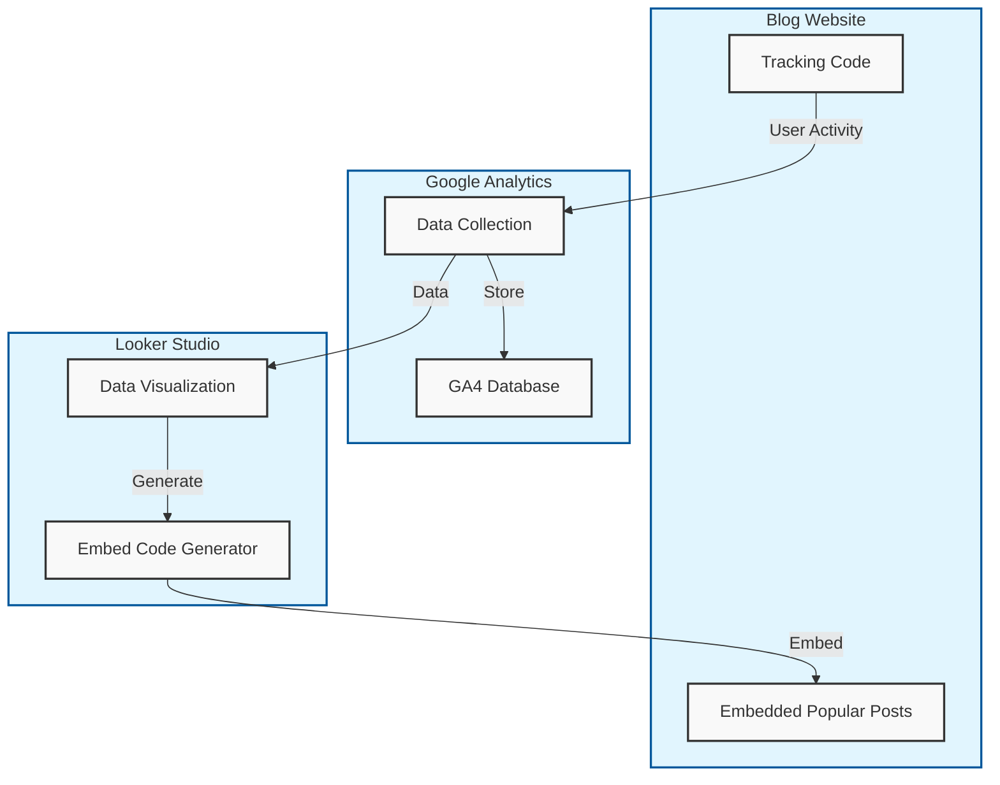

---
{"dg-publish":true,"title":"Google Ananlytics를 이용하여 블로그 인기 글 모듈 만든 후 서비스하기","description":"해당 프로젝트를 구현하기 위한 기획이나 아키텍쳐등 프로젝트 소개가 담긴 글입니다.","permalink":"/projects/library/kr/100/110/110-20/kr-110-20/","dgPassFrontmatter":true,"noteIcon":"0","created":"2025-01-25T23:06:15.052+09:00","updated":"2025-03-18T11:06:40.931+09:00"}
---

현재 노트: [[Projects/Library/KR/100/110/110.20/KR-110.20\|KR-110.20]] Google Ananlytics를 이용하여 블로그 인기 글 모듈 만든 후 서비스하기
하위 분류:
- [[Projects/Library/KR/100/110/110.20/KR-110.20 a\|KR-110.20 a]] Google Analytics API 구현 및 임베드 코드를 위한 Looker Studio사용과 UI를 위한 추가 업데이트

#개인프로젝트 #Google_Analytics

# 프로젝트 기획

### 기획
기존 Google Analytics를 활용하여 API 사용한 결과값 필터링 후, 사용하기 편하게 임베드 모듈형태로 사용하기로 기획

### 기획 근거
- 기존 Google Analytics를 사용하고 있음으로 쿼리 하는 API를 배우기만 하면 될 것
- 임베딩 코드를 제공하는 기능도 Google Analytics에서 제공할 것이라 예산

운영중인 블로그의 방문자 수를 늘리기 위해 인기 글 5개를 보여주는 서비스를 추가하고 싶어서 해당 프로젝트를 시작해봅니다.

  
### 기획
기존 Google Analytics를 활용하여 API 사용한 결과값 필터링 후, 사용하기 편하게 임베드 모듈형태로 사용하기로 기획

### 기획 근거
- 기존 Google Analytics를 사용하고 있음으로 쿼리 하는 API를 배우기만 하면 될 것
- 임베딩 코드를 제공하는 기능도 Google Analytics에서 제공할 것이라 예산

# 아키텍쳐

  

  

# 기술 스택

- Google Analytics -> 수집
- Looker Studio -> 임베드 코드 제공

  

### 테스트

  

- @google-analytics/data
- Node.js
