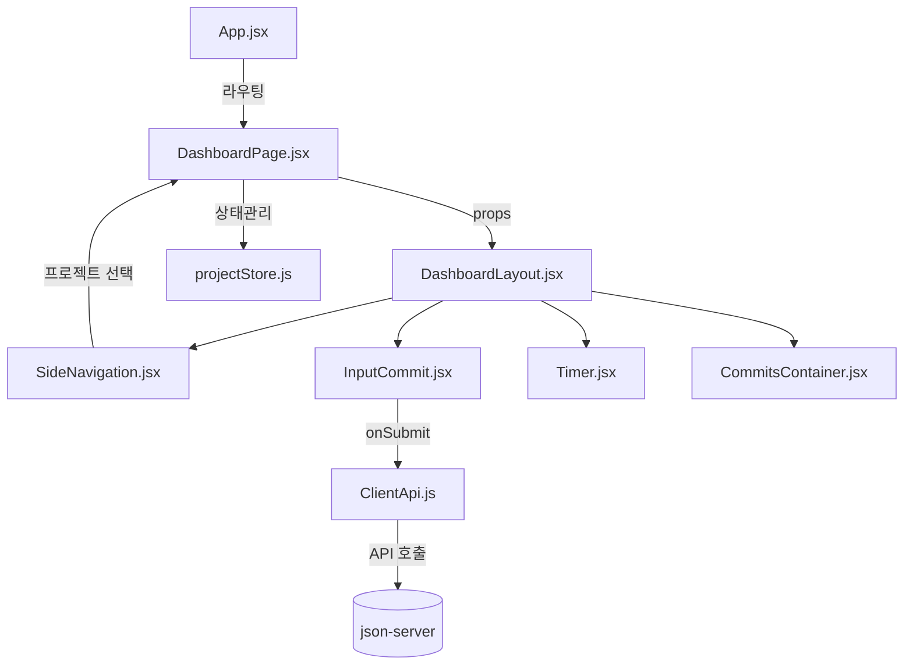

---
{"dg-publish":true,"title":"project log","description":null,"permalink":"/projects/library/kr/100/110/110-60/kr-110-60/","dgPassFrontmatter":true,"noteIcon":"0","created":"2025-03-04T13:48:45.674+09:00","updated":"2025-06-12T21:44:36.704+09:00"}
---

현재 노트: [[Projects/Library/KR/100/110/110.60/KR-110.60\|KR-110.60]] 
상위 분류: [[Projects/Library/KR/100/110/KR-110\|KR-110]] 

#개인프로젝트 
프로젝트 목적
취업을 위한 채용공고에서 요구되는 역량을 학습해보기 위한 프론트엔드 프로젝트입니다.

프로젝트 소개
여러 프로젝트를 코딩하는 시간이 많지만 단순히 커밋만 하다보니 어떤 프로젝트를 얼마나 작업을 수행했는지, 어떤 작업을 했는지와 같은 피드백을 하기 어렵다고 느꼈습니다.
그래서 이런 작업 현황을 시각화 하기위해 프로젝트 별로, 프로젝트에서 작업 단위 별로 기록하기 위한 웹 서비스가 필요하다고 느껴서 이를 기록하는 `project log`라는 이름의 프로젝트를 기획했습니다.


## 대분류별 기술 스택 및 역할

| 영역       | 주요 기술/라이브러리         | 역할 및 설명                         |
|-----------|------------------------------|--------------------------------------|
| 프론트엔드 | React, Vite, Zustand         | SPA, 상태관리, 빠른 개발환경         |
| UI/스타일  | TailwindCSS, Material UI     | 일관된 디자인, 반응형 UI, 컴포넌트 참고 |
| Mock API  | json-server                  | RESTful API 시뮬레이션, 데이터 저장    |
| 테스트     | Jest, @testing-library/react | 유닛/컴포넌트 테스트                  |
| 문서/스토리 | Storybook                   | UI 컴포넌트 문서화 및 개발            |
| 기타       | ESLint, Stylelint            | 코드 품질 및 스타일 검사             |


  

## 주요 구성 영역별 사용 기술

  

- **프로젝트/커밋 관리**: React, Zustand, json-server

- **UI/UX**: TailwindCSS, Material UI 참고, 커스텀 컴포넌트

- **상태관리**: Zustand (프로젝트, 커밋, UI 상태 등)

- **API 통신**: axios, ClientApi.js (RESTful 방식)

- **타이머/시간 기록**: React 상태, Timer 컴포넌트

- **사이드바/레이아웃**: 커스텀 레이아웃 컴포넌트, TailwindCSS

- **테스트/문서화**: Jest, Storybook

  

---

  

## 실행 방법

  

```bash
npm install
npm start

```

- `npm start` : 서버(json-server)와 Vite 개발서버 동시 실행

- 개발서버만 실행: `npm run dev`

- API 서버만 실행: `npm run start:server`
  

## 아키텍처 (Mermaid)

  



  

---

  

## 데이터 구조 예시

  

```json

{

  "projects": [

    {

      "id": "project-1",

      "name": "프로젝트명",

      "description": "프로젝트 설명",

      "architecture": "프로젝트 아키텍처",

      "status": "진행중",

      "createdAt": "timestamp",

      "modifiedAt": "timestamp",

      "totalTime": "누적 작업시간",

      "commitsIds": ["commit-1", "commit-2"],

      "tags": ["웹", "모바일"]

    }

  ],

  "commits": [

    {

      "id": "commit-1",

      "parentProjectId": "project-1",

      "message": "커밋 메시지1",

      "timeSpent": "작업시간",

      "createdAt": "timestamp",

      "modifiedAt": "timestamp"

    },

    {

      "id": "commit-2",

      "parentProjectId": "project-1",

      "message": "커밋 메시지2",

      "timeSpent": "작업시간",

      "createdAt": "timestamp",

      "modifiedAt": "timestamp"

    }

  ]

}

```

## UI/UX

- 프로젝트 선택 GNB, 커밋 목록 SNB

- 각 프로젝트 탭/사이드바/메인영역 전환

- 타이머, 커밋 입력, 프로젝트 개요 등

  

## 참고/특이사항

- 커밋 성공 시 전체 페이지 새로고침 없이, 사이드바 상태 유지 및 커밋만 실시간 추가되도록 개선

- json-server의 중첩 데이터 구조 미지원으로, id 기반 참조 방식 사용

  

- (옵션) storybook을 통한 컴포넌트 관리
	- 하는 중
- (옵션) webpack 번들 라이브러리
- (옵션) zustand 상태 관리 라이브러리 사용여부

- (고민) 서버 통신 DB 연동

깨달음
- ui 러이브러리 컴포넌트는 사용하 돼, 템플릿은 사용하지 말기. 템플릿은 배치와 어떤 컴포넌트를 쓸 것인가까지 전부 정해버려서 너무 라이브러리 종속적이게 됨.

jest 스냅샷  기능 활용해보기 `npm instll -D jest`
**Jest**의 `toMatchSnapshot()`메소드와 `@testing-library/react`의 `render` 활용

# Jest의 React사용시 에러
CommonJS가 기본이라 ESM과 JSX도 해석을 잘 못함
https://jestjs.io/docs/ecmascript-modules
# ECMAScript Modules
>![caution] 
>Jest ships with **experimental** support for ECMAScript Modules (ESM).
>The implementation may have bugs and lack features. For the latest status check out the [issue](https://github.com/jestjs/jest/issues/9430) and the [label](https://github.com/jestjs/jest/labels/ES%20Modules) on the issue tracker.
>Also note that the APIs Jest uses to implement ESM support are still [considered experimental by Node](https://nodejs.org/api/vm.html#vm_class_vm_module) (as of version `18.8.0`).


빌드도구 `Vite`와 **ESM**을 지원하기 까다롭고 **CommonJS**가 base인 `Jest`이다 보니 여기에 `React` 스냅샷 빌드가 매우 어려움을 느낌. 동작하기 위해서 jestConfig, barbelConfig 필요하다고 하는데...

다른 도구 `vitest`사용시도

안해 안됨.
@storybook의 test까지 찾아봤는데 너무 jest wrapper의vitest의  wrapper인 storybook test인 것 같아서 해보다가 (이것도 결국 안되서) 포기


# UI 라이브러리

쉽고 빠르게 디자인 적인 측면을 해결 가능함

내가 볼점 커스텀 얼마나 가능한지
리액트적용 여부
추가로 active, hover와 같은 상태변화 지원같은 추가 기능

UI라이브러리 특성상 여러 라이브러리가 있는데 검색해서 유명하고 대표적인것만 모아봄

#  [MUI](https://mui.com/)
https://mui.com/material-ui/
**Material UI is an open-source React component library that implements Google's Material Design.**

 Google의 Material Design 프레임워크를 준수하기 때문에 널리 사용된되빈다.
Material-UI는 광범위한 문서와 커뮤니티 덕분에 유연한 편입니다.

# [Ant Design](https://ant.design/)
https://ant.design/
Help designers/developers building beautiful products more flexible and working with happiness

다양한 구성 요소와 도구를 지원합니다
. 매우 사용자 정의가 가능하며 고유한 디자인에 적합합니다. 인기와 활발한 커뮤니티
AND의 단점으로 logic handle이 어렵다고함. 즉 라이브러리 커스텀이 불편하다는 점

# [Chakra UI](https://chakra-ui.com/)

개발자 경험과 특정 기능에 초점을 맞춘 UI 라이브러리입니다. 라이브러리는 가볍고 디자인이 일관적입니다.

# [Mantine](https://mantine.dev/)
Build fully functional accessible web applications faster than ever – Mantine includes more than 100 customizable components and 50 hooks to cover you in any situation


### 참고사례 
 **MUI  -> AntDesign -> Mantine 사용중인 유저**


**tailwind css 쓰다가, Shadcn를 쓸 뻔 하다가 Mantaine 라이브러리로 옮겨가게된 FE 리더**


결론
MUI -> 취직을 위한 가장 광범위되고 큰 커뮤니티


mantaine 기능 자체는 다른 라이브러리들보다 좋긴한데 개인프로젝트용으로 괜찮고 취직에는 아쉬움
 
순위 shadcn https://ui.shadcn.com/ 요즘 인기가 많지만 사용할 바에 mantaine사용


참고
- Mantine 라이브러리 관련 실제 경험 언급
  https://www.reddit.com/r/reactjs/comments/1ci5hmr/why_dont_more_people_use_mantine/
- 커뮤니티 레딧 사이트https://www.reddit.com/r/reactjs/comments/1bc16y2/choosing_a_ui_library_that_makes_everyones_life/ 

- 한 회사의 기술 블로그
  https://www.sencha.com/blog/7-reasons-to-use-ui-component-libraries-to-style-web-apps/#:~:text=A%20UI%20library%20is%20a,piece%20together%20these%20stunning%20elements.


# UI 라이브러리 사용시 생각한점

## 한계점은 pro enterprise급의 유료 컴포넌트가 있다는점
StaticDateRangePicker와같은 두 캘린더사이의 선택한 시간영역을 표기해주는 컴포넌트와 같은 복잡한 동작의 경우 유료사용료가 필요하다. 즉 UI 라이브러리의 한계점으로 결국 쓸만한 컴포넌트의 경우 유료사용이 요구됨

#### 컴포넌트는 사용하 되, 템플릿은  사용하지말기.
어떤 컴포넌트를 넣을지, 어떤 구조로 넣을지 이런 부분조차 정해져 버리기 때문.
예를들어 SingUp Template쓰면 넣어야할 요소들이 전부 들어가고 간격도 정해져서 나옴.

#### shorthand CSS는 사용하지 말고  common CSS에 가까운 표현 사용하기
예를들어 Materail UI에서  `marginY`는 `marginTop`과 `marginBottom`을 동시에 표현한 것 이니 가능하면 CSS속성에 가까운것 사용하기.
CSS에서 `margin-top`과 `margin-Bottom`은 존재하는 속성으로 common CSS에 가까움.

또한 `marginTop={3}` 과 같은 표현으로 Material UI에서는 *1단위*당 *8px*을 표현하는데 tailwind같아서 보기 좋지만 되도록이면 common CSS에 가까운 `marginTop: 24px` 사용하기


#### 페이지 단위 보다 작은것인 템플릿 단위 보다 작은 것이 컴포넌트 단위
페이지의 경우 직관적으로 이해하기 쉬움
템플릿은 여러 컴포넌트들이 모인것 또는 간단하것이라면 단일 컴포넌트로 구성가능
컴포넌트는 각 요소.
예를들어 홈페이지(페이지) -> 로그인 창(템플릿) -> 이름입력 버튼(컴포넌트)

#### style대신 sx쓰는 이유
theme 와 같은 전역 변수 값 사용 `const theme = createTheme({})`
중첩 선택자 `& .hover` 지원 ( 바닐라CSS는 2023부터 지원하긴함)


#### UI 라이브러리 포기하게 만드는 이유


결국theme을 사용하기 위해서 useTheme();을 사용하게 만드는점 떄문에 그냥 UI 라이브러리 사용안하기로함.
쓰다 보니깐 Box라는 컨테이너위주로 쓰는데 div랑 차이를 모르겠음.
그나마 theme관련 쓰고 Camel을 통한 관리등이 장점이라고 생각했는데


다음의 컴포넌트 처럼 theme의 값을가져오려하니깐 useTheme이라는 mui훅을 사용하라고함. 딱 보기에도 useContext의 wrapper인데 그렇다면 처음부터 차라리 useContext나 아예 관리하기위한 zustand같은 상태관리 라이브러리 쓰지, wrapper인 useTheme을 쓰고 싶지 않음. 관리를 위한 관리를 위한 관리같은 느낌이라
`<Chip label={theme.projectStatuses.success.label} color="error" />`


또 사용하다보니 좋은것은 돈주고 써야함.
https://mui.com/x/api/date-pickers/static-time-picker/


만약 UI라이브러리 사용할려면은 시간들여서 만들기 귀찮은 관리를 전혀 생각할 필요없는것을 바로 가져다 쓰고싶을때 사용할듯. 말그대로 해당 컴포넌트의 정말 단순하게 절대 렌더링로직이나 세세하고 어려운부분을 수정하지 않을 예정인 컴포넌트에 써야할듯.

컴포넌트 만들어서 사용하는 방식은 UI 라이브러리 없는게 나은듯.


# 직접 UI 라이브러리 만들기

고민 **일반적으로 ui 라이브러리를 내가 직접만들어서 사용한다고할때, 


# UI라이브러리 사용함녀서 얻은 경험
나중에 직접 커스텀 자체 UI 라이브러리 만들 때 어떤 props로 넣어야하는지? 에대한 힌트
어떤 ui 컴포넌트를 만들어야할까?에 대한 힌트


 variant 
 정해진 크기
 정해진 배경색 및 호버시효과
 글자크기
 display

# Button의 기본 display값 고민
  
딱하나 마지막고민 Button ui컴포넌틑 를 만들어서 적당히 사용하기에는 .idsplay의 inline-block이 좋아보임. 근데 어떨때는 flex가 좋아보임

왜냐하면 button이 쭈욱 늘어나는 문제가생겼는데 이게 부모가 flex라서 strech에의해 강제됐기때문.

이때 부모컨테이너의 flex라서 문제인건지, 자식컴포너트의 값이 문제가 생기는 것인지 모르잖아. 이걸 쉽게 하기위해서 button은 flex로 할까하는데 보통 버튼은 딱 그모야 그대로쓰이길 원하니깐inline-block이 어울려서 고민임

`  const sizingClasses = "w-max h-max flex-shrink-0 flex-grow-0";`


# zustand 리렌더링 고려해서 제대로 사용해보기

처음 시도
```
// 테마별 스타일 정의
const styles = {
  light: {
    button: {
      base: "font-medium rounded transition-colors focus:outline-none",
      primary: "bg-blue-600 hover:bg-blue-700 text-white",
      secondary: "bg-gray-500 hover:bg-gray-600 text-white",
      success: "bg-green-500 hover:bg-green-600 text-white",
      warning: "bg-yellow-500 hover:bg-yellow-600 text-white",
      error: "bg-red-500 hover:bg-red-600 text-white",
      outline: "border border-blue-600 text-blue-600 hover:bg-blue-50",
    },
    chip: {
      default: "bg-gray-100 text-gray-800 hover:bg-gray-200",
      primary: "bg-blue-100 text-blue-800 hover:bg-blue-200",
      success: "bg-green-100 text-green-800 hover:bg-green-200",
      warning: "bg-yellow-100 text-yellow-800 hover:bg-yellow-200",
      error: "bg-red-100 text-red-800 hover:bg-red-200",
    },
  },
  dark: {
    button: {
      primary: "bg-blue-700 hover:bg-blue-800 text-white",
      secondary: "bg-gray-600 hover:bg-gray-700 text-white",
      success: "bg-green-600 hover:bg-green-700 text-white",
      warning: "bg-yellow-600 hover:bg-yellow-700 text-white",
      error: "bg-red-600 hover:bg-red-700 text-white",
      outline: "border border-blue-400 text-blue-400 hover:bg-blue-900 hover:bg-opacity-30",
    },
    chip: {
      default: "bg-gray-700 text-gray-300 hover:bg-gray-600",
      primary: "bg-blue-900 bg-opacity-30 text-blue-300 hover:bg-opacity-40",
      success: "bg-green-900 bg-opacity-30 text-green-300 hover:bg-opacity-40",
      warning: "bg-yellow-900 bg-opacity-30 text-yellow-300 hover:bg-opacity-40",
      error: "bg-red-900 bg-opacity-30 text-red-300 hover:bg-opacity-40",
    },
  },
};
```

기본 리렌더링 고민
buttoon 시 chip도 리렌더링 되는지?
-> 아님

초기 사용법
```
  const ButtonTheme = useTheme((state) => getStyle(state.mode, "button"));
  const buttonText = children || "Button";
  // 기본 스타일 클래스 (Tailwind 사용)
  const baseClasses = ButtonTheme["base"];
```
심화 리렌더링 고민
추가 button에서 primary 99개 쓰는데, error1개 쓰는 컴포넌트에서 error 색깔수정시 99개의 primary 버튼도 리렌더링 되는지?
-> 그렇다 button 채로 구독하기 때문

**그렇다면 해결법은 button객체중의 그 단일 속성만 get해서 사용하기**
```
  const baseClasses = useTheme((state) => state.getStyle(state.mode, "button").base);

  // variant에 따른 스타일
  const variantClasses = useTheme((state) => state.getStyle(state.mode, "button")[variant]);
```

`zustand는 구독할때 반드시 단일 속성을 지정하기`


# json-server로 api를 통해 데이터 가져오기

다음과 같은 데이터를 사용할 예정입니다.
`projects`배열과 `commits` 배열을 사용하며 `commitsIds`와 `projectId`를 통해 외래키를 제공합니다.
```
{
  "projects": [
    {
      "id": "project-1",
      "name": "웹 포트폴리오",
      "description": "개인 포트폴리오 웹사이트 개발",
      "architecture": "React + Node.js",
      "status": "진행중",
      "createdAt": "2023-01-15T09:00:00Z",
      "modifiedAt": "2023-01-20T15:30:00Z",
      "totalTime": "35h",
      "commitsIds": ["commit-1", "commit-2"],
      "tags": ["웹", "모바일"]
    },
    {
      "id": "project-2",
      "name": "쇼핑몰 앱",
      "description": "안드로이드 쇼핑 애플리케이션",
      "architecture": "Flutter + Firebase",
      "status": "완료",
      "createdAt": "2023-02-10T10:00:00Z",
      "modifiedAt": "2023-03-05T18:45:00Z",
      "totalTime": "120h",
      "commitsIds": ["commit-3", "commit-4", "commit-5"],
      "tags": ["모바일", "앱"]
    }
  ],
  "commits": [
    {
      "id": "commit-1",
      "projectId": "project-1",
      "message": "초기 프로젝트 설정 및 레이아웃 구현",
      "timeSpent": "5h",
      "createdAt": "2023-01-15T14:30:00Z",
      "modifiedAt": "2023-01-15T14:30:00Z"
    },
    {
      "id": "commit-2",
      "projectId": "project-1",
      "message": "반응형 디자인 적용",
      "timeSpent": "8h",
      "createdAt": "2023-01-18T11:45:00Z",
      "modifiedAt": "2023-01-18T11:45:00Z"
    },
    {
      "id": "commit-3",
      "projectId": "project-2",
      "message": "앱 기본 구조 설계",
      "timeSpent": "12h",
      "createdAt": "2023-02-10T16:20:00Z",
      "modifiedAt": "2023-02-10T16:20:00Z"
    }
  ]
}

```

처음 데이터 접근을 위해 `project`에 접근하고, 해당 project의 `commits`들을 얻을 수 있는지 확인해봅니다.

프로젝트 정보 접근 -> `/projects/:id`  **동작**
프로젝트 안의 커밋정보 접근 -> `/projects/:id/commits` **실패**

검색 결과 0.17에서는 됐는데,현재 최신 버전인 1.0.0기준으로 동작하지 않는것 같습니다.
https://github.com/typicode/json-server/releases/tag/v1.0.0-beta.3 해당 버전의 원본 소스와 ReadMe를 살펴보았는데도 중첩된 구조의 라우팅 기능이 없고 대신 `_embed`라는 키워드가 있어 이를 사용할 수 있었습니다.

하지만 이럴 경우 다시 한번 편집이 필요하게됐습니다. 왜냐하면 기존의 project 객체의 결과 +  해당 객체를 외래키로 가지는 객체가 추가되기 때문입니다.
```
{
  "id": "project-1",
  "name": "웹 포트폴리오",
  "description": "개인 포트폴리오 웹사이트 개발",
  "architecture": "React + Node.js",
  "status": "진행중",
  "createdAt": "2023-01-15T09:00:00Z",
  "modifiedAt": "2023-01-20T15:30:00Z",
  "totalTime": "35h",
  "commitsIds": [
    "commit-1",
    "commit-2"
  ],
  "tags": [
    "웹",
    "모바일"
  ],
  "commits": [
    {
      "id": "commit-1",
      "projectId": "project-1",
      "message": "초기 프로젝트 설정 및 레이아웃 구현",
      "timeSpent": "5h",
      "createdAt": "2023-01-15T14:30:00Z",
      "modifiedAt": "2023-01-15T14:30:00Z"
    },
    {
      "id": "commit-2",
      "projectId": "project-1",
      "message": "반응형 디자인 적용",
      "timeSpent": "8h",
      "createdAt": "2023-01-18T11:45:00Z",
      "modifiedAt": "2023-01-18T11:45:00Z"
    }
  ]
}
```


그래서 접근한 방식이 쿼리필터 방식 ->  `/commits?projectId=project-1` **동작**


#### fetch를 위해서 api폴더 생성


# React router 없이 라우팅 구현하기
상태관리를 통해  zustand사용 id관리
```
import { useState } from "react";
import "./App.css";
import HomeLayout from "@layouts/HomeLayout";
import DashboardLayout from "@layouts/DashboardLayout";
import { SideNavigation } from "@components/SideNavigation";
import useProjectStore from "@store/projectStore";

function App() {
  // 테스트용: 레이아웃 전환 위한 상태
  const [showHome, setShowHome] = useState(true);
  const { selectedProjectId, setSelectedProjectId } = useProjectStore();

  // 프로젝트 선택 시 대시보드로 전환하는 함수 (나중에 라우터로 대체)
  const handleProjectSelect = (projectId) => {
    setSelectedProjectId(projectId);
    setShowHome(false);
  };

  // 홈으로 돌아가는 함수
  const handleBackToHome = () => {
    setShowHome(true);
  };

  return (
    <>
      {showHome ? (
        // 홈 레이아웃 - 모든 프로젝트 표시
        <HomeLayout onProjectSelect={handleProjectSelect} />
      ) : (
        // 대시보드 레이아웃 - 선택된 프로젝트 상세 표시
        <DashboardLayout
          header={
            <div className="flex justify-between items-center">
              <h1 className="text-xl font-bold">프로젝트 대시보드</h1>
              <button onClick={handleBackToHome} className="px-4 py-2 bg-gray-200 text-gray-800 rounded hover:bg-gray-300 transition-colors">
                홈으로 돌아가기
              </button>
            </div>
          }
        >
          <SideNavigation id={selectedProjectId}></SideNavigation>
        </DashboardLayout>
      )}
    </>
  );
}

export default App;

```


# 타이머가 백그라운드에서 동작을 안함

원인
- `setInterval` 함수는 브라우저 탭이 백그라운드 상태가 되면 성능 최적화를 위해 실행 빈도가 줄어들 수 있습니다. 보통 브라우저들은 비활성 탭에서 타이머의 실행 빈도를 제한합니다.
- 특히 Chrome과 같은 브라우저에서는 백그라운드 탭의 `setTimeout`이나 `setInterval`의 최소 간격을 1초(1000ms) 정도로 제한하기도 합니다. 귀하의 코드는 10ms 간격으로 설정되어 있으므로 영향을 받을 가능성이 높습니다.


처음엔 inputcommit에 버튼추가하고 부모컴포넌트로 데이터전달 그리고 layout해서 처리시도

서버가 없는 느낌이라 단순히하드코깅된 경로 fetch후 객체끝에 데이터 추가하는 방식 고려

너무 문제가 많이 생길 수 있다고 생각
그래서 일반적인 방법인 api호출 방식고려
현재 json-server에서는 postAPI지원.

- clientAPI에 API 설계

Layout이 클라이언트 호출
inputcommit의 데이터로 json-server에 호출
그리고 layout에서 page로 동작여부를 알려서 loading상태를 호출
그럼 page의 useEffect의 의존성에 걸린 loading에의해 새로운 프로젝트 정보로 업데이트


---
먼저 client API에서 커밋에서처럼 project를 post하는 기능 생성

homepage에서 폼 모달 버튼 생성

json-server에서 id가 없으면 자동생성
그럼 관리가 어려우니 api단에서 shortId생성 16진수 4 자리